# WEEK3 2024.01.28-2024.02.04
## 完成了环境的面向对象编程，为DRQV-2的接入和未来环境的添加做了接口

BaseEnv类作为基类，新增的环境只需要提供xml file，重写step和reset的部分

BaseEnv类作为基类，新增的环境只需要提供xml file，重写step和reset的部分

自带renderer,允许添加不同视角的摄像机

提供了三个wrapper类（DRQV2所需的）：

- StandardWrapper:调整动作范围为[-1,1]
- StackWrapper:允许将多帧的观察（向量或是图片）叠加在一起
- RepeatWrapper:延长决策间的间隔


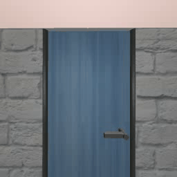

## 重写了DRQV2代码，使之与环境适配

对代码的所有部分都进行了重写，包含replay_buffer,recorder的所有部分

对其做出了部分修改：

- DRQV2的repr_dim是固定的，仅支持84*84左右大小的观察大小，对其进行了修改使之能够适**配各种渲染大小的观察空间**
- 仍然存在的问题是，actor中存在repr_dim*feature_dim的线性层，**增大渲染尺寸的结果很容易导致参数量快速增大**

```python
class Actor(nn.Module):
    def __init__(self, repr_dim, action_shape, feature_dim, hidden_dim):
        super().__init__()

        self.trunk = nn.Sequential(nn.Linear(repr_dim, feature_dim),
                                   nn.LayerNorm(feature_dim), nn.Tanh())
```

## 进行了三轮测试运行，对环境稳定性进行了增强
第一轮测试包含四组实验，在渲染分辨率和action_repeat两项参数上做了测试

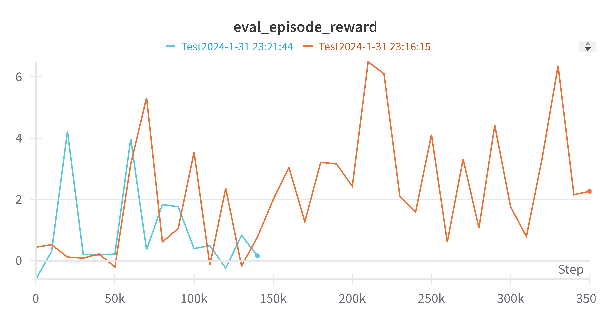

action_repeat=10（单步时长0.02秒，每秒50帧）时渲染精度为128和256的曲线对比，蓝线为256，橙线为128

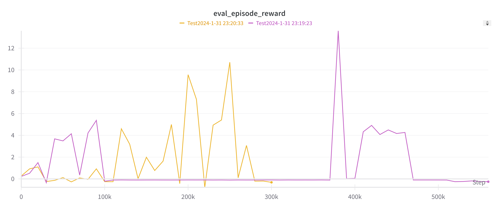

action_repeat=20（单步时长0.04秒，每秒25帧）时渲染精度为128和256的曲线对比，黄线为256，紫线为128

**256渲染大小训练速度会慢很多**

不过这一轮训练除此以外基本没有得到有效的数据，因为出现了很明显的数值爆炸

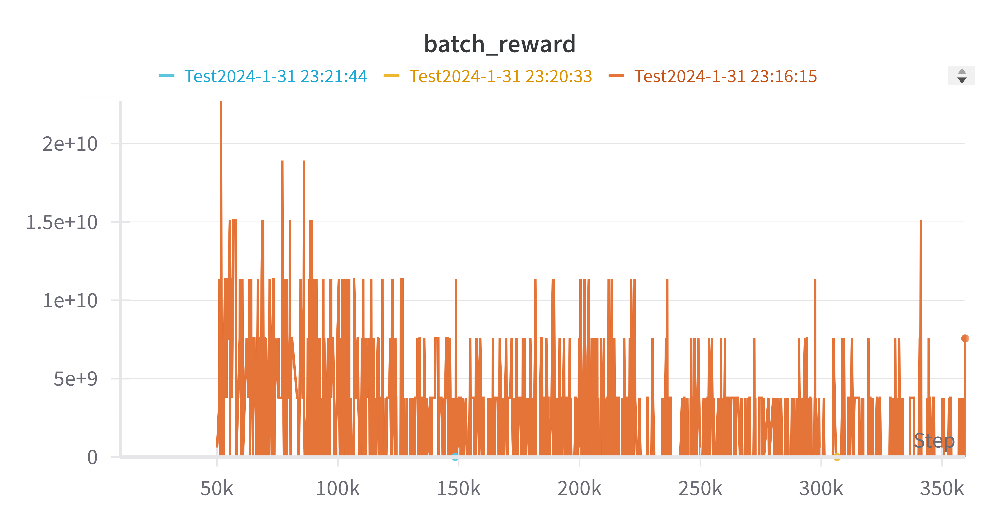

原因是环境给出的奖励出现了数值不稳定的情况，大量的接近0的低奖励和少量数百的高奖励很容易导致Q函数数值爆炸

检查之后发现拟真中有不稳定的成分，非常容易崩溃：
```log
WARNING: Nan, Inf or huge value in QPOS at DOF 0. The simulation is unstable. Time = 1.3880.

WARNING: Nan, Inf or huge value in QACC at DOF 7. The simulation is unstable. Time = 3.1500.

WARNING: Nan, Inf or huge value in QVEL at DOF 0. The simulation is unstable. Time = 0.0500.

WARNING: Nan, Inf or huge value in QACC at DOF 0. The simulation is unstable. Time = 0.1060.

WARNING: Nan, Inf or huge value in QPOS at DOF 0. The simulation is unstable. Time = 0.3480.
```

此外，完成训练的机器人往往也显得有些“呆滞”


之后的两轮测试主要都是对环境做稳定性增强：
* 将机器人和门之间的距离增大（为2.5米），防止偶然开门
* 增加了天花板，四周的墙面也增加了碰撞
* 对各个关节的速度和位置做了限制，不能出现极端速度和位置

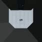
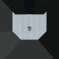

左为原本的环境，右为增加速度限制的环境（随机种子相同）

## 第四轮测试

### 设置
* `action_repeat`=20 （每秒40帧）
* `render_size`=128
* `num_frames`=2.5M

奖励计算机制：$R_t = \frac{\delta_X+\delta_{DOOR}}{X_{max}+DOOR_{max}*ratio}$ （类似加权平均）

其中$\delta_X$为机器人在X轴方向的距离变化，$\delta_{DOOR}$为门的开合变化，$X_{max}$为机器人在X轴方向的最大距离，$DOOR_{max}$为门的最大开合距离，$ratio$为门开合在奖励中所占的比例。

设置四组实验，每组只有`ratio`设置不同，为0，1，10，100

即：完全不看门开合(ratio=0)，完全看门开合(ratio=100)，门开合占主要的奖励(ratio=10)，门开合占一部分的奖励(ratio=1)

环境结束条件：机器人的质心通过门（X轴上距离大于3）或者门打开90度（Door hinge大于1.5）或者达到10秒（500步）

### 结果
稳定训练完成，

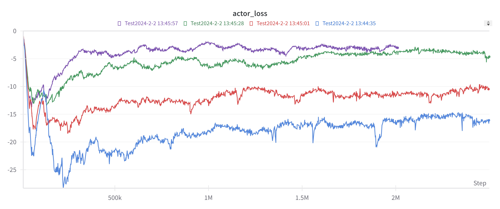

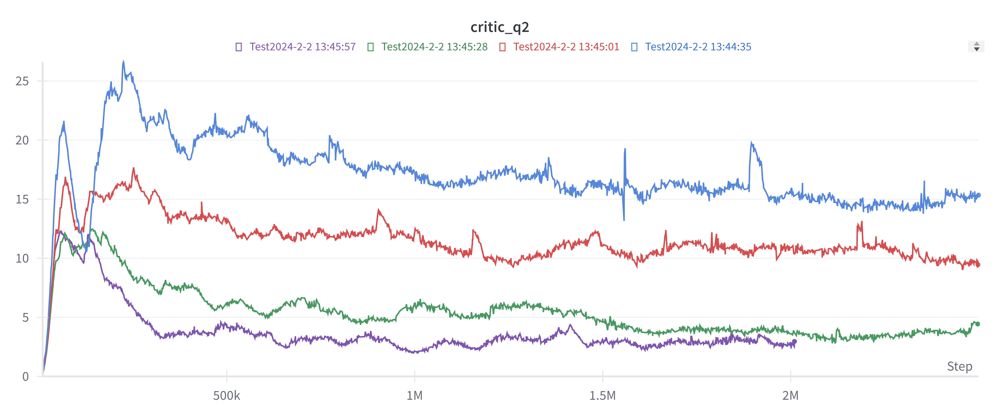


对每组，取2.4M到2.5M之间的十组里reward较高的一组录像的结果

#### exp 1 ratio = 0
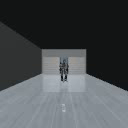

#### exp 2 ratio = 1
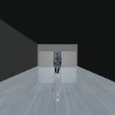

#### exp 3 ratio = 10
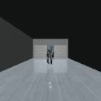

#### exp 4 ratio = 100
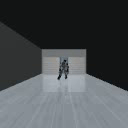

四组都能做到开门，比较出人意料的是第三组效果最差，可能有一些随机性，也可能是其他原因

所有组的开门基本上都是滑铲完成的，这个问题自然与我们的Reward设置有关。

## TODO
1. 继续调整reward设置，一种可能是直接利用已经有的开门demo做模仿学习（但是数据量太小）
2. 其他……